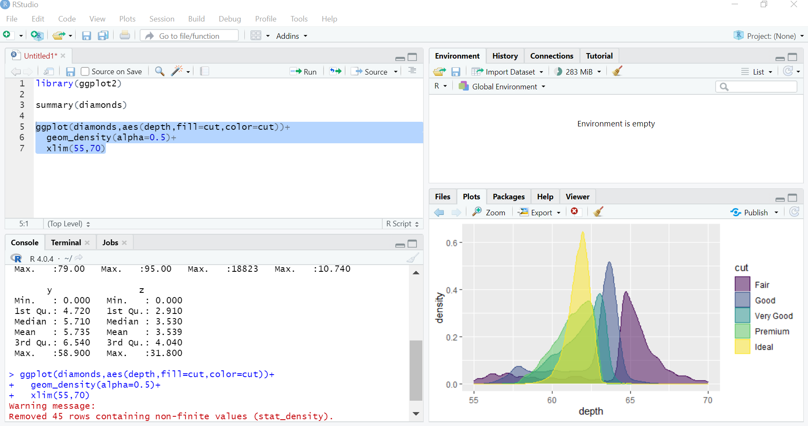

******
# Dowload R and RStudio
We will describe the main step to install R and RStudio on your local machine.

## R installation

* Windows: go to [https://cran.r-project.org/bin/windows/base/](https://cran.r-project.org/bin/windows/base/) 
and download the .exe file and install it on your machine.

* Macosx: go to [https://cran.r-project.org/bin/macosx/](https://cran.r-project.org/bin/macosx/) 
and download the file according to the spec. of your machine. 

* Linux: go to [https://cran.r-project.org/bin/linux/](https://cran.r-project.org/bin/linux/) 
select your distribution and follow the instructions to install R and its dependencies.

## RStudio installation

Go to [https://www.rstudio.com/products/rstudio/download/#download](https://www.rstudio.com/products/rstudio/download/#download) 
and download the installation file according to your operative system.  
<center>
{width=80%}
</center>

******

# R as a calculator
## Numeric operators
Now let's get in touch with the basic R operators, we want to calculate the
following expressions.
$$\left[\frac{1}{2}\cdot\left(e^{5}-\frac{2}{3^{5}}\right)\right]-\sqrt{2\cos\left(\frac{\pi}{3}\right)\sin\left(\frac{2\cdot\pi}{3}\right)}\,,\\
{10\choose 4}\ln(2)\,.$$


```{r collapse=TRUE}
((1/2)*(exp(5)-2/(3^5)))-sqrt(2*cos(pi/3)*sin(2*pi/3))
factorial(10)/(factorial(4)*factorial(6))*log(2)
```

Instead of line breaks to separate different statements, you can use the semicolon operator `;`.

<div class="fold o">
```{r hold=TRUE}
2/0;0/0;sin(pi) #why is not zero?
```
</div>

An important operator is the comment operator **<tt>#</tt>**. Whenever R encounters this 
operator, it will ignore everything printed after it (in the current line).


## Logical operators
The logical operators are very important for data manipulation. When R evaluates statements containing logical operators it will return either TRUE or FALSE.

```{r collapse=TRUE, results='markup'}
1< 2 #less than
1<=2 #less than or equal
1> 2 #greater than
1>=2 #greater than or equal
1==2 #equal than
1!=2 #not equal
TRUE & FALSE # and
TRUE | FALSE # or
```

Can you guess the result of the following script?
<div class="fold o">
```{r}
23 & 45; 0 | 1
```
</div>


******

# Need an help, ask R

While reading an R script, you can bump into an unknown R’function, the first thing to 
do is to ask directly R. To do this you can use the function **<tt>help()</tt>**, remember put the name
of the function inside the brackets. 

Who knows what the **<tt>lm()</tt>** function does?

<div class='fold s'>
```{r,eval=FALSE}
help(lm)
```
</div>

******

# Objects
R is an object-oriented language. This means that everything in R is an object. When we  run the script we create and manipulate objects. To master R, it is important to understand the basic data types and data structures and how to operate on them.

## Types

The type of an object is  a property assigned to an object that determines how generic functions operate with it.
The **<tt>typeof()</tt>**  function returns the type of an object. R distinguishes the following main types of objects:

* integer: integer numbers ;
* real (double): real numbers;
* character: elements made up of text-strings; for example, "Germany";
* logical: data containing logical constants, namely, TRUE and FALSE.

Try to guess the outcome of the following sum:

<div class='fold o'>
```{r error=TRUE}
1+1.3+'a'+TRUE
```
</div>

## Assignments
For sure we do not want to compute an object every time we need it, especially if 
comes from a time-consuming calculation. To store an object and to easily recall
it, we assign it to a variable name through the assignment operator **<tt><-</tt>** or **<tt>=</tt>**.

```{r}
x<-2+5
```

On the environment tab, up-right corner of RStudio, you will find a list of the 
object stored in the current working directory, alternatively, you can use the 
**<tt>ls()</tt>** command. To remove the object, you can use the **<tt>rm()</tt>** function (inside the brackets put the name of the variable).

<div class='fold o'>
```{r error=TRUE, result='hide'}
rm(x)
```
</div>

## Structures
We will just introduce the needed data structures for this course we will leave 
out other structures, such as factors and functions.

### Vectors
Vectors are one-dimensional sequences of elements of the same type.
To create a vector, you need to use the **<tt>c()</tt>** function, where
**<tt>c</tt>** stands for concatenate.
```{r}
a<-c(6,9,12,15)
a<-c(a,c(0,3))# concatenate the vector with another vector and store it with the same name
#  equivalently a<-c(a,0,3)
```

Let's sort the created vector in ascending or descending order using the 
**<tt>sort()</tt>** function.  Check its help pages to see what additional
options you can specify, look at the **<tt>decreasing</tt>** argument.

<div class='fold s'>
```{r error=TRUE}
sort(a); sort(a, decreasing=TRUE) #why I don't need to specify decreasing=FALE in the first one
```
</div>

What type of object is the following one, try to answer and then use the **<tt>class()</tt>** function to check
<div class='fold o'>
```{r}
class(c(a,'b'))
```
</div>
Indeed.
<div class='fold s o'>
```{r}
c(a,'b')
```
</div>
For sure manually typing all the elements of the vector isn't the only option we can use the function **<tt>seq()</tt>**:
```{r}
seq(from=0,to=15,by=3) #setting the increments with the argument by
seq(from=0,to=16, length.out=6) #setting the length of the the vector 

```
Which is the output of the following line of code ? Hint: ask R.
<!-- example to understandthe order of the argument of a function -->
<div class='fold o'>
```{r}
seq(0, 15, 2)
```
</div>

Furthermore, you can use the colon operator, namely **<tt>:</tt>**, to tell R to create an integer vector with a regular numbers sequence.
```{r}
pi:6;8:-8
```

#### Basic Vector operators
Here we show some useful mathematical functions that works with real vectors.
```{r collapse=TRUE}
x<-seq(0.4,100,3) #  define a vector x
sum(x)
prod(x)
min(x)
max(x)
length(x)
y<-seq(pi,56.8,length.out=length(x)) #create a vector with equal length of y

head(x+y);head(x*y) #head function just give the first six elements
```


#### Vector slicing
Slicing a vector is done through the square brackets **<tt>[]</tt>** operator. 
```{r collapse=TRUE}
x<-c('These','are','not','the','exercise','of','neuroscience','class')
x[c(3,4)] #select the 3rd and the 4th element
x[-3] #all except the 3rd element
x[2:4]
```

Logical operators can be very useful in slicing a vector. 
```{r}
y<- -10:20
y<=0 #the logical operator is applied element-wise
y[y<=0&y!=-5]
y[y<0|y>5]
```

What is the output of the expression:
<div class='fold o'>
```{r}
c(FALSE, TRUE) | c(TRUE, TRUE)
```
</div>

Write an R expression that will return the sum of the vector (2, 1, 4, 2, 1, NA),
use the slicing techniques to remove the NA.

<div class='fold s o'>
```{r results="hold"}
x <- c(2, 1, 4, 2, 1, NA)
sum(x[-length(x)]);sum(x,na.rm =TRUE )
```
</div>

### Matrices
A matrix is a collection of the same data type arranged into a two-dimensional data structure, namely rows and columns. To create a matrix, we use the **<tt>matrix()</tt>** function which takes the following arguments:

* **<tt>data</tt>**: a data vector;
* **<tt>nrow</tt>**: the desired number of columns;
* **<tt>ncol</tt>**: the desired number of rows;
* **<tt>byrow</tt>**: a logical statement to populate the matrix either by row or column, the default is FALSE.

Create a $2\times 3$ matrix of ones.
<div class='fold s o'>
```{r collapse=TRUE}
M1<-matrix(data=1,nrow = 2, ncol = 3)
M1 # we use the dim() function to check the dimension of the created matrix
dim(M1)
```
</div>
What is the result of the following scripts:
<div class='fold o'>
```{r error=TRUE,results='hold'}
matrix(1:11,nrow=4)
```
</div>
<div class='fold o'>
```{r error=TRUE,results='hold'}
matrix(1:12,nrow=4,byrow=TRUE)
```
</div>
We can create a matrix also binding together vectors by row **<tt>rbind()</tt>** using and by columns **<tt>cbind()</tt>**. The former function automatically labels rows/columns using the names of the  vectors, but you can use **<tt>rownames()</tt>** and **<tt>colnames()</tt>** to label rows and columns respectively.

```{r}
x<-c(1001:1010)
y<-c(1,0,0,1,0,0,1,1,0,1)
z<-cbind(x,y)
colnames(z)<-c('patient_id','treatment')
z
```

#### Basic Matrix operators

R can do matrix arithmeti. Here you can find a list of some basic operation:

* **<tt>+ - * / </tt>** standard scalar or by element operations;
* **<tt>$\%*\%$</tt>** matix multiplication;
* **<tt>t()</tt>** transpose;
* **<tt>det()</tt>** determinant;
* **<tt>solve()</tt>** inverse.


#### Matrix slicing
As done for the vector we use the squared bracket **<tt>[]</tt>** to slice
a matrix. Let $M$ be a matrix the $m_{i,j}$ element is  retrieved in R by
**<tt>[i,j]</tt>**.
```{r collapse=TRUE}
M<-matrix(1:9,3,byrow=TRUE)
M
M[2,3] #extract the 3rd element of the 2nd row
M[2:3,] #extract the 2nd and 3rd row
M[,3] #extract the 3rd column

```

Write a script that extracts from the matrix M all the columns containing a value higher than 7 in the third row.
<div class='fold s o'>
```{r}
M[,M[3,]>7]
```
</div>

Given the vectors x<-c(1:10) and y<-c(1:3), create a matrix $M$ , such that
$m_{(i,j)}=x_i+y_j$. Use the **<tt>outer()</tt>** function.

<div class='fold s o'>
```{r collapse=TRUE}
x<-c(1:7)
y<-c(1:3)
outer(x,y,"+")
```
</div>

### Lists
An R list is an object, which contains elements of different types like, such as numbers, strings, vectors, and lists. A list is created using **<tt>list()</tt>** function, to access the element of the list we can use the squared brackets **<tt>[]</tt>** or **<tt>$key_name</tt>** if a key, character, is assigned to the element.

```{r collapse=TRUE}
#create a list
x<-list(patient_name='Rob',tratment=c(3,2),'112'='Jo',5)
x[1] # show the key name, if present, and the value in the first entry of the list
x[[1]] #  reference the first  element of the list directly
x$hospital # there is no such a key
x$tratment[2]
x$'112'
```

### Data frames

A data frame is a list of named vectors (called columns) of the same length. Therefore each column contains elements of the same type. You can slice a data frame in the same way that you can slice a matrix, furthermore, you can also use the **<tt>$</tt>**, as done for the lists, to select columns. We use the **<tt>data.frame()</tt>** function to create a data frame 

```{r collapse=TRUE}
x<-seq(1,10)
y<-letters[1:5] # extract the first five letters of the alphabet
z<-matrix(x,nrow=5,byrow=5)
df<-data.frame(z,treatment=y)
class(df)
df
names(df) #names of the coluns
str(df) #summarize the structure of the data frame


with(df,X1+X2) # that is equal to df$X1+df$X2
subset(df,df$X1>5) # that is equal to df[df$X1>5,]
```

#### Load and save data frames

Creating and editing data frames in R can be cumbersome, indeed R isn't a 
spreadsheet. For this reason, the data are created using different programming
languages and then loaded into R. We will show how to load **<tt>.csv</tt>** 
files, but keep in mind that R can load a huge variety of file formats. 

We use the commands **<tt>getwd()</tt>**, **<tt>setwd()</tt>** and  **<tt>list.files()</tt>**
to manage our working directory. R uses **<tt>/</tt>** as path separator even on
Windows.
<!-- /* never a good choice to move to the data directory*/ -->

```{r results='hide'}
getwd() # print the name of the current working directory
#setwd("./data") change the working directory  to the data, ./ is very useful to create relative path
```

```{r}
list.files("./data") # list the files in the current directory
```

Always try to keep separate the data from the analysis, working inside the data
directory could lead to data loss or corruption.

Let's say we want to read the <a href="./data/study1.csv" download><tt>study1.csv()</tt></a> file. We  use
the general function **<tt>read.table()</tt>**, that allows to set the
delimiter , to include or not the headers, and more. 

```{r collapse=TRUE}
study1<-read.table("./data/study1.csv",sep=";",header = TRUE) # the values are separated by ; in the csv file
head(study1)
str(study1)
stud1_new<-subset(study1,study1$group=='a') # keep only the data from group a
```

In order to save the new data frame **<tt>stud1_new()</tt>** we use the 
general function **<tt>write.table()</tt>**.

```{r}
write.table(stud1_new,file="./data/study1_new.csv",col.names=TRUE,sep=";")
```

```{r echo=FALSE,results='hide'}
file.remove("./data/study1_new.csv")
```


## Exercises

### Exercise 1
Generate a vector of length 20 containing some numbers and sort it in descending order.
What do the related **<tt>rank()</tt>** and **<tt>order()</tt>** functions do?
Create a matrix (vector, vector of ranks). Use **<tt>order()</tt>** function to 
sort the vector in ascending order.

<div class='fold s o'>
```{r collapse=TRUE}
x <- c(seq(1,15,by=2),-4:4,pi,11,13)
print(x) # print the vector
length(x) # return the length of the variable

# decreasing oder:
sort(x, decreasing=TRUE)

#na.last argument controlling the treatment of NA
sort(c(5,7,1,NA,3))
sort(c(5,7,1,NA,3), na.last=TRUE) #put last
sort(c(5,7,1,NA,3), na.last=FALSE) # put first
sort(c(5,7,1,NA,3), na.last=NA) #removed

# return the vector of ranks
rank(x)
sum(rank(x))
cbind(x, "rank()"=rank(x))

# order return the index order corresponding to the ascending order of the elements of the vector
x[order(x,decreasing = FALSE)]
```
</div>

### Exercise 2

Add two columns to the **<tt>study1</tt>** data frame:

1. A column with  logical values, that says for every entry of the **<tt>before</tt>** column if is lower than 0.3.

2. A column with logical values, that says for every entry of the **<tt>after</tt>** column if is greater than 0.4.

Return the rows that fulfill both the above conditions, namely rows with value true in both columns. How many patients fulfill the above conditions?

<div class='fold s o'>
```{r}
temp<-study1$after<0.3 #create an extra vector
study1<-cbind(study1,temp) # bind together the data frame and the vector
names(study1)[length(study1)]<-'after_l_0.3' # similarly tail(study1)<-'after_l_0.3'

#in a more compact way 
study1<-data.frame(study1, 'before_gr_0.4'=with(study1,before>0.4))
head(study1)

subset(study1,study1$before_gr_0.4 & study1$after_l_0.3)

```
</div>


******

# Basic plotting

One of the basic plotting functions is the **<tt>plot()</tt>** function. This is a generic function, namely the type of plot produced is dependent on the type or class of the first argument.
For example:

* **<tt>plot(x_vector, y_vector)</tt>** produces a scatter plot of y against x
* **<tt>plot(x_vector)</tt>** a scatter plot of x against index of x
* **<tt>plot(data frame)</tt>** each variable against the others

```{r,collapse=TRUE,fig.align='center'}
str(study1)
plot(subset(study1,select=-c(group)),
     main= 'Study 1 results', # title of the plot
     col = factor(study1$group) # color for the points accoding to the group
     )
```

The  **<tt>curve()</tt>** function draws the given expression over the given interval **<tt>[from,to]</tt>**.

```{r fig.align='center'}
curve(exp(-0.5*(x^2))/sqrt(2*pi),from=-5,to=5,
      xlab="x", #label of the x axis
      main= "Standardt normal distribution",
      ylab=bquote(phi[mu==0~','~sigma^{2}==1](x)) #label of y axis
)
```


## Exercises

### Exercise 1
Plot the points (`study1$before`,`study1$after`) and use the function **<tt>abline()</tt>** to add a straight line with intercept 1 and slope 0. Use the example in `?abline` to understand how to use the latter function.

<div class='fold s o'>
```{r,fig.align='center'}
plot(study1$before,study1$after,col=factor(study1$group),
     xlim=c(-0.1,1),
     ylim=c(-0.1,1),
     xlab="before",ylab="after")
abline(0,1)
# extra how to add the legend
legend("topleft",
       legend=c("a","b"),
       col=c('red',"black"),
       pch = 1)

```
</div>


### Exercise 2

Use the **<tt>seq()</tt>** function to generate a vector **<tt>x</tt>** of
length 100 of evenly spaced numbers between 0 and $2\pi$. Draw a plot of
**<tt>x</tt>** against **<tt>sin(x)</tt>**. Look at the **<tt>type</tt>** 
argument of function **<tt>plot()</tt>** to draw a connecting line. Use
the **<tt>lines()</tt>** function to add the cosine to the plot.

<div class='fold s o'>
```{r,fig.align='center'}
x<-seq(from=0, to=2*pi,length.out=100)
plot(x,sin(x),
     ylab='', # no y axis label
     type='l'# we want to plot a lines that connects the points
     ) # same curve(sin(x),from=0,to=2*pi)
lines(x,cos(x),col='red') # add the cos
abline(0,0) # add the x axis
```
</div>

