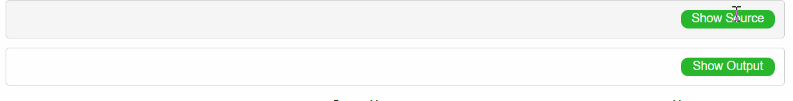

These are the exercises for the courses of Introduction to Statistics for Neuroscience class held  by:

:::::: {.columns}
::: {.column width="24%" data-latex="{0.24\textwidth}"}

Prof. Dr. Tim Friede

Department of 

Medical Statistics

UMG

[tim.friede@med.uni-goettingen.de](mailto:tim.friede@med.uni-goettingen.de?subject=Introduction%20to%20Statistics%20for%20Neuroscience class)

:::
::: {.column width="24%" data-latex="{0.24\textwidth}"}

{width=90%}
:::
::: {.column width="4%" data-latex="{0.04\textwidth}"}
\ 
<!-- an empty Div (with a white space), serving as
a column separator -->
:::
:::::: {.column width="24%" data-latex="{0.24\textwidth}"}

Dr. Andreas Leha

Core Facility 'Medical Biometry

and Statistical Bioinformatics

UMG

[Andreas.Leha@med.uni-goettingen.de](mailto:Andreas.Leha@med.uni-goettingen.de?subject=Introduction%20to%20Statistics%20for%20Neuroscience class)

:::

::: {.column width="24%" data-latex="{0.24\textwidth}"}

{width=90%}
:::
::::::

The exercise sessions are held by:

:::::: {.columns}
::: {.column width="48%" data-latex="{0.24\textwidth}"}

Francesco Taverna

Department of Medical Statistics, UMG

[francesco.taverna@med.uni-goettingen.de](mailto:francesco.taverna@med.uni-goettingen.de?subject=Introduction%20to%20Statistics%20for%20Neuroscience class)

:::
::: {.column width="24%" data-latex="{0.24\textwidth}"}
\
:::

::::::

##  Useful links
How to install R: [https://rstudio-education.github.io/hopr/starting.html](https://rstudio-education.github.io/hopr/starting.html)

The basics of R: [https://rstudio.cloud/learn/primers/1.2](https://rstudio.cloud/learn/primers/1.2)

Slides:

Short Test:

## Solution

The solutions will be made public after each exercise session. Click the green buttons 'Show Source' and 'Show Output' to look at the lines of code and the outputs.

Examaple of how to interact with the show-hide buttons.

The following calendar will be updated as soon as the solution will be released.

| Lecture|Scheduled lecture day|Solution available| Release date |
|:---|:---|:---|:---|
| R intro | 26 October |`r emo::ji("heavy_check_mark")`  | 21 October|
| Exercises 1 | 27 October| `r emo::ji("heavy_check_mark")` | 1 November|
| Exercises 2 | 1 November| `r emo::ji("heavy_check_mark")` | 2 November|
| Exercises 3 | 2 November| `r emo::ji("heavy_check_mark")` | 4 November|
| Exercises 4 | 3 November| `r emo::ji("heavy_check_mark")` | 9 November|
| Exercises 5 | 8 November| `r emo::ji("heavy_check_mark")` | 11 November|
| Exercises 6 | 9 November| `r emo::ji("heavy_check_mark")` | 12 November|
| Exercises 7 | 10 November | `r emo::ji("x")`   ||
| Exercises 8 | 15 November | `r emo::ji("x")`  ||
| Exercises 9 | 16 November | `r emo::ji("x")` ||
| Exercises 10 |17 November | `r emo::ji("x")`||

## Reading Recommendations

:::::: {.columns}
::: {.column width="24%" data-latex="{0.24\textwidth}"}

Introductory Statistics for the Life and Biomedical Sciences, 1st Edition

Julie Vu and Dave Harrington

freely available at: [https://leanpub.com/biostat](https://leanpub.com/biostat)

:::
::: {.column width="2%" data-latex="{0.02\textwidth}"}
\ 
<!-- an empty Div (with a white space), serving as
a column separator -->
:::

::: {.column width="22%" data-latex="{0.22\textwidth}"}

{width=100%}
:::
::: {.column width="4%" data-latex="{0.04\textwidth}"}
\ 
<!-- an empty Div (with a white space), serving as
a column separator -->
:::
::: {.column width="24%" data-latex="{0.24\textwidth}"}

OpenIntro Statistics, 4th Edition

David Diez, Mine Cetinkaya-Rundel and Christopher Barr

freely available at: [https://leanpub.com/os](https://leanpub.com/os)

:::
::: {.column width="2%" data-latex="{0.02\textwidth}"}
\ 
<!-- an empty Div (with a white space), serving as
a column separator -->
:::
::: {.column width="22%" data-latex="{0.22\textwidth}"}

{width=100%}
:::
::::::

## Acknowledgments

The course is based on lectures notes by Prof. Dr. Klaus Jung, TiHo Hannover.

The R introduction and some exercises take inspiration from the lectures notes of Prof. Dr. Paolo Vidoni, Università di Udine.

